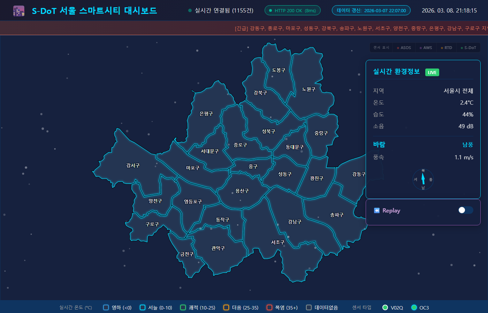
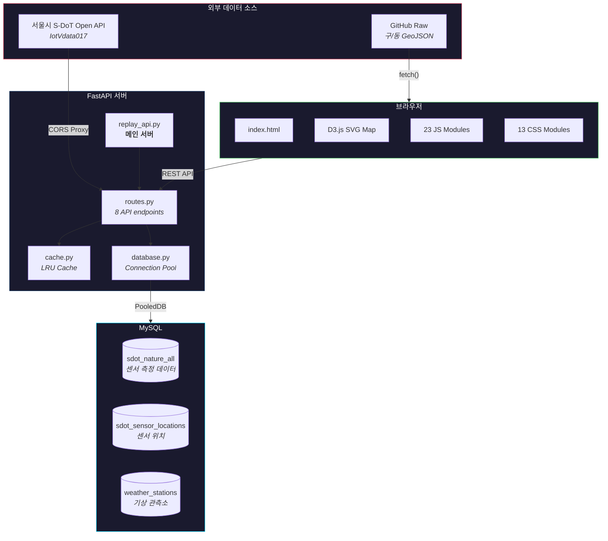
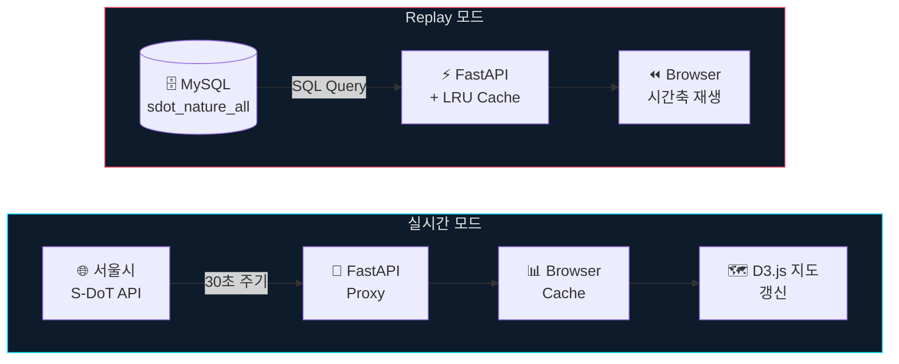

<div align="center">

# S-DoT 서울 스마트시티 대시보드

**서울시 전역 1,200+ IoT 센서의 환경 데이터를 실시간 시각화하는 도시 모니터링 플랫폼**

[](https://seoul-smartcity-dashboard.onrender.com/)

<br>


<br>



</div>

---

## 프로젝트 개요

| 항목 | 내용 |
|:----:|------|
| 프로젝트명 | 서울시 센서데이터(S-DoT) 기반 기후·환경 안전도시 구현 |
| 수행 기간 | 2026.01.30 ~ 2026.02.05 (7일) |
| 공간 범위 | 서울시 전역 25개 자치구, 1,200+ 센서 설치 지점 |
| 내용 범위 | 대기질(PM2.5, PM10, O3), 기온, 습도, 풍향, 소음 등 17종 |
| 목적 | 환경 센서 데이터의 체계적 수집·통합 관리, 빅데이터 분석을 통한 환경 현황 파악, 데이터 기반 정책 대안 발굴 |

---

## 팀 구성

| 이름 | 역할 |
|:----:|------|
| 양우성 | 데이터 수집 · 수집 자동화 시스템 구축 · DB 설계 |
| 전민준 | 데이터 수집/분석 · 전처리 · 시각화 |
| 박형민 | 데이터 분석 · 시계열 분석 · 트렌드 파악 |
| 소혜경 | 기획 · 정책 제안 과제 발굴 · 보고서 작성 |
| 이채영 | 기획 · 분석결과 정책적 해석 · 타당성 검토 |

---

## 주요 성과

| 지표 | 수치 |
|:----:|:----:|
| 센서 데이터 수집 | **1,200+** 개소 (서울시 전역 25개 자치구 S-DoT 센서 + ASOS/AWS/RTD 관측소) |
| 데이터 레코드 | **4,300만+** 건 |
| 자치구 분석 | **25**개 구 |

---

## 시스템 아키텍처



---

## 주요 기능

### 실시간 모니터링

| 기능 | 설명 |
|:----:|------|
| 🗺️ | 25개 자치구 **온도 히트맵** (영하/서늘/쾌적/더움/폭염) |
| 🔍 | 자치구 → 행정동 → 센서 **3단계 드릴다운** |
| 🌡️ | 온도, 습도, 소음, 풍향/풍속 **실시간 패널** |
| 📡 | ASOS / AWS / RTD / S-DoT **센서 레이어 토글** |
| ⚠️ | PM2.5 등 **이상치 감지 경보** 알림 바 |
| 🧭 | SVG **풍향 나침반** 애니메이션 |

### Replay (과거 데이터 재생)

| 기능 | 설명 |
|:----:|------|
| 📅 | 날짜 선택 + 시간 **슬라이더** (0~23시) |
| ▶️ | 0.5x / 1x / 2x **자동 재생** |
| 🔎 | 데이터 없는 시간대 **±12시간 자동 탐색** |
| 💾 | 오늘: 5분 / 과거: 7일 **TTL 캐시** |

### API 서버 성능

| 기능 | 설명 |
|:----:|------|
| 🗜️ | GZip 압축 (30~70% **전송량 절감**) |
| 🔄 | 서울시 API **CORS 프록시** |
| 📦 | LRU 캐시 **2,600 entries** |
| 🔌 | DB 연결 풀 **최대 10 동시 연결** |

---

## 데이터 파이프라인



---

## API 명세

| Endpoint | 설명 | 파라미터 | 캐시 TTL |
|:---------|:-----|:---------|:---------|
| `GET /` | 대시보드 메인 페이지 | - | - |
| `GET /health` | 서버 상태 확인 | - | - |
| `GET /api/v1/sensors` | 센서 위치 목록 (S-DoT + ASOS + AWS + RTD) | - | `1시간` |
| `GET /api/v1/metadata` | 데이터 범위 메타데이터 | - | `24시간` |
| `GET /api/v1/replay` | 특정 날짜/시간의 센서 데이터 | `date`, `hour` | 오늘: `5분`, 과거: `7일` |
| `GET /api/v1/replay/date-range` | 데이터 존재 날짜 목록 | `start`, `end` | `24시간` |
| `GET /api/v1/sdot-proxy` | 서울시 Open API 프록시 | `district` | - |
| `GET /api/v1/cache/stats` | 캐시 통계 | - | - |
| `GET /api/v1/cache/clear` | 캐시 전체 삭제 | - | - |

---

## 프로젝트 구조

```
sdot_dashboard/
├── Dockerfile                    # python:3.11-slim 기반 컨테이너
├── requirements.txt              # Python 의존성
├── start.sh                      # 서버 시작 스크립트
│
├── FastAPI/
│   ├── replay_api.py             # 메인 서버 (CORS, GZip, 정적 파일 서빙)
│   ├── routes.py                 # API 엔드포인트 (8개 라우트)
│   ├── database.py               # DB 연결 풀 관리 (PooledDB)
│   ├── cache.py                  # LRU 캐시 (3개 독립 캐시 + 정리 스레드)
│   ├── config.py                 # 환경변수 로드 + 로깅
│   ├── requirements.txt          # FastAPI 전용 의존성
│   └── .env.example              # 환경변수 템플릿
│
└── Front/
    ├── index.html                # SPA 엔트리 (D3.js + 패널 UI)
    ├── css/                      # 13 stylesheets
    │   ├── style.css             #   통합 진입점
    │   ├── base.css              #   전역 스타일, 다크 테마
    │   ├── map.css               #   지도 SVG
    │   ├── navbar.css            #   상단 네비게이션
    │   ├── panels.css            #   공통 패널
    │   ├── panels-info.css       #   환경정보 패널
    │   ├── panels-replay.css     #   Replay 패널
    │   ├── markers.css           #   센서 마커
    │   ├── legend.css            #   지도 범례
    │   ├── alerts.css            #   경보 알림
    │   ├── animations.css        #   전환 애니메이션
    │   ├── responsive.css        #   반응형
    │   └── utilities.css         #   유틸리티
    └── js/                       # 23 modules
        ├── config.js             #   전역 설정/상태
        ├── init.js               #   초기화
        ├── api.js                #   API 통신
        ├── map.js                #   구 경계선 렌더링
        ├── dong-overlay.js       #   동 경계선 오버레이
        ├── dong-markers.js       #   동 센서 마커
        ├── dong-zoom.js          #   동 확대/축소
        ├── view.js               #   뷰 상태 관리
        ├── sensor-layer.js       #   센서 레이어 토글
        ├── sensor-markers.js     #   센서 마커 생성
        ├── replay.js             #   Replay 토글
        ├── replay-mode.js        #   Replay 진입/해제
        ├── replay-data.js        #   Replay 데이터 처리
        ├── replay-ui.js          #   Replay UI
        ├── anomaly.js            #   이상치 감지
        ├── wind.js               #   풍향 나침반
        ├── location.js           #   지역 진입 연출
        ├── ui.js                 #   공통 UI
        ├── ui-info.js            #   환경정보 패널
        ├── ui-tooltip.js         #   호버 툴팁
        ├── ui-traceback.js       #   발원지 역추적
        ├── http-status.js        #   HTTP 상태 모니터링
        └── utils.js              #   유틸 함수
```

---

## 실행 방법

### 1. 환경변수 설정

```bash
cp FastAPI/.env.example FastAPI/.env
```

```env
DB_HOST=127.0.0.1
DB_PORT=3306
DB_USER=root
DB_PASSWORD=your_password
DB_NAME=sdot_db
SDOT_API_KEY=your_seoul_api_key
```

### 2. 데이터베이스 설정

```sql
CREATE DATABASE sdot_db DEFAULT CHARACTER SET utf8mb4;

-- 센서 측정 데이터
CREATE TABLE sdot_nature_all (
    시리얼 VARCHAR(20),
    등록일시 DATETIME,
    온도 FLOAT, 습도 FLOAT, 소음 FLOAT,
    풍향 FLOAT, 풍속 FLOAT,
    PM10 FLOAT, PM25 FLOAT,
    -- 기타 17종 환경 지표 컬럼
    INDEX idx_date (등록일시),
    INDEX idx_serial (시리얼)
);

-- 센서 위치 정보
CREATE TABLE sdot_sensor_locations (
    시리얼 VARCHAR(20) PRIMARY KEY,
    자치구 VARCHAR(20),
    행정동 VARCHAR(30),
    위도 DOUBLE,
    경도 DOUBLE
);

-- 기상 관측소 (ASOS/AWS)
CREATE TABLE weather_stations (
    id VARCHAR(10) PRIMARY KEY,
    name VARCHAR(50),
    type VARCHAR(10),  -- 'ASOS' 또는 'AWS'
    lat DOUBLE,
    lng DOUBLE
);
```

### 3. 로컬 실행

```bash
pip install -r requirements.txt
cd FastAPI && python replay_api.py
# http://localhost:8000
```

### 4. Docker 실행

```bash
docker build -t sdot-dashboard .
docker run -p 8000:8000 --env-file FastAPI/.env sdot-dashboard
```
